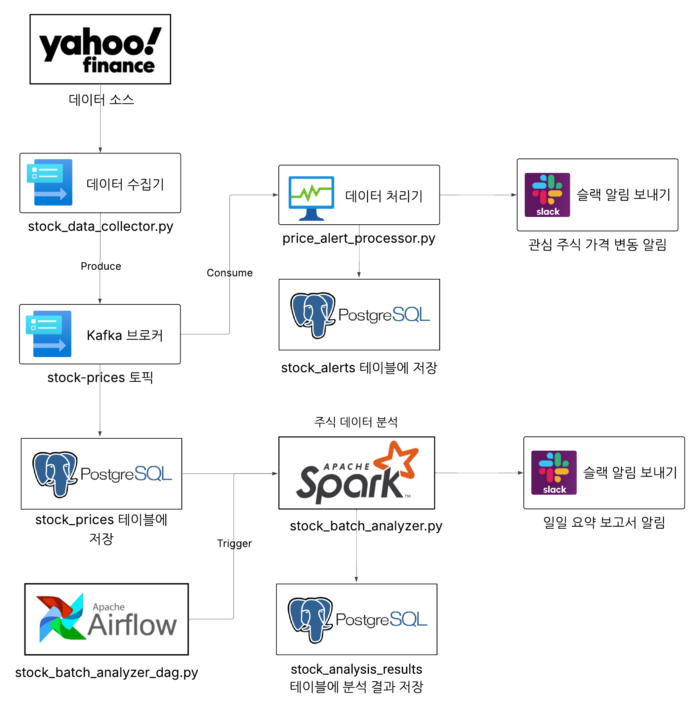
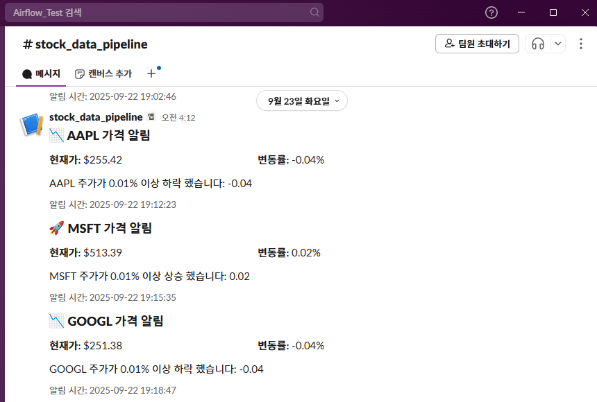
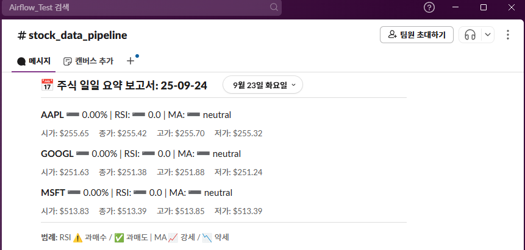

# 📈 실시간 주식 알림 시스템 (Real-Time Stock Alert System)

## 🧩 1. 프로젝트 개요

**프로젝트명:** 실시간 주식 알림 시스템 구축  
**프로젝트 목적:**  
투자자가 관심 있는 종목의 실시간 가격 변동을 자동 감지하고, 조건에 따라 알림 및 일일 보고서를 발송하는 시스템 구축을 목표로 함.

**도입 배경:**
- 주식 시장은 실시간으로 변화하며 단기간에도 대량의 정보가 발생
- 기존 증권사 앱의 알림 기능은 한정적이며 장기 데이터 분석이 어려움
- 본 프로젝트는 사용자가 지정한 조건에 따라 실시간 알림을 제공하고, 일별 데이터를 기반으로 리포트를 자동 발송하여 **효율적인 투자 의사결정**을 지원함

---

## 🎯 2. 목표 및 KPI

**목표**
- 종목별 가격 데이터를 실시간으로 수집하고, 변동 조건 충족 시 알림 발송
- 매일 지정된 시간에 일일 보고서 자동 발송
- 수집 데이터를 장기 분석용으로 축적 및 관리

**KPI**

| 지표명 | 측정 기준 | 목표 |
| --- | --- | --- |
| 데이터 수집 안정성 | 누락 데이터 비율 | 99% 이상 수집 |
| 알림 전달 성공률 | 조건 충족 시 알림 발송 비율 | 99% 이상 발송 |
| 알림 정확도 | 잘못된 알림 비율 | 1% 미만 발송 |
| 보고서 자동화 | 일일 보고서 자동 발송 여부 | 지정 시간에 발송 |
| 보고서 데이터 완전성 | 포함 종목 및 지표 누락 여부 | 누락 없음 |
| 장기 데이터 축적 | 수집된 모든 데이터 보관 여부 | 99% 이상 보관 |

---

## 🏗️ 3. 시스템 아키텍처

**데이터 흐름:**  
`Yahoo Finance API → Kafka → Spark/DB → Slack 알림`  
전체 파이프라인의 스케줄링은 **Apache Airflow**가 담당

### 구성 요소

1. **데이터 수집기**
   - Yahoo Finance API로 지정된 주식 종목의 실시간 데이터 수집  
   - 수집 데이터를 Kafka 토픽으로 전송 (`stock-prices`)  
   - 1분 단위 수집 및 오류 재시도 로직 포함  
   - **기술 스택:** `yfinance`, `kafka-python`

2. **가격 알림 처리기**
   - Kafka Consumer로부터 데이터 수신  
   - 변동률 계산 후, 설정된 임계값(`PRICE_CHANGE_THRESHOLD`) 초과 시 Slack 알림 발송  
   - PostgreSQL(`stock_alerts` 테이블)에 알림 이력 저장  
   - **기술 스택:** `Kafka`, `PostgreSQL`

3. **알림 모듈**
   - Slack Webhook을 통한 알림 전송  
   - 알림 템플릿 포맷팅 및 재시도 로직 포함  
   - **기술 스택:** `requests`, `Slack Webhook`

4. **Apache Spark 배치 처리기**
   - Kafka 또는 PostgreSQL에서 주가 데이터 로드  
   - 이동평균(MA), RSI, MACD 등 기술적 지표 계산  
   - 종목별 패턴 및 추세 분석 후 JSON/CSV/Parquet 형태로 저장  
   - **기술 스택:** `PySpark`, `Pandas`, `JSON`

5. **Airflow 워크플로우**
   - Spark 분석 작업을 정기적으로 스케줄링  
   - 결과를 요약하여 Slack 및 이메일로 발송  
   - **기술 스택:** `Apache Airflow`, `Slack Notifier`

**시스템 구조도**  

---

## ⚙️ 4. 구현 내용

### 1️⃣ 데이터 수집기
- `yfinance` API로 종목(`STOCK_TICKERS`)의 가격, 거래량, 변동률 실시간 수집  
- `kafka-python` 프로듀서로 `stock-prices` 토픽 전송  
- 실패 시 재시도 및 로깅(`log_utils`) 수행  

**주요 기능**
- 실시간 데이터 요청
- Kafka 메시지 생성 (`produce_stock_data`)
- 로그 기록 및 예외 처리

---

### 2️⃣ 가격 알림 처리기
- Kafka Consumer로부터 주가 데이터 수신  
- 변동률 계산 후, 설정된 임계값 초과 시 Slack 알림 발송  
- PostgreSQL에 알림 내역 저장  

**핵심 기능**
- 가격 변화율 계산  
- Slack 알림 발송 (`SlackNotifier`)  
- PostgreSQL 저장 (`save_alert_to_postgres`)  

**📸 알림 시연 이미지 (AAPL, MSFT, GOOGL)**  
****

---

### 3️⃣ 배치 분석기
- PostgreSQL(`stock_prices`)에서 과거 주가 데이터 읽기  
- 이동평균선, RSI, MACD 등 기술적 지표 계산  
- 종목별 신호 분석 결과를 JSON으로 저장  
**📸 일일 리포트 시연 이미지 (AAPL, MSFT, GOOGL)**  
****

**📊 JSON 출력 예시**
```json
{
  "AAPL": {
    "ticker": "AAPL",
    "date": "2025-09-23",
    "close": 256.09,
    "rsi": 0.0,
    "macd": 0.0,
    "trend": "neutral",
    "signals": []
  }
}
```
---
### 4️⃣ 워크플로우 오케스트레이션

- Airflow DAG을 통해 Spark 분석 자동화  
- `process_results` 태스크에서 Spark 결과 요약 후 Slack 보고  

**DAG 흐름**
```jsx
create_output_dir → analyze_stocks(Spark 실행) → process_results → send_report(Slack)
```
---
### 🧰 사용 기술 요약

| 구분 | 기술 스택 |
| --- | --- |
| 데이터 수집 | yfinance, kafka-python |
| 스트림 처리 | Kafka, PostgreSQL |
| 분석 | PySpark, Pandas |
| 워크플로우 | Apache Airflow |
| 알림 | Slack Webhook, requests |
---

## 🚀 성과 및 개선

**성과**
- 실시간 주가 알림 시스템 완전 자동화  
- 일일 보고서 Slack 자동 발송 성공  
- PostgreSQL 데이터 적재 안정성 99% 이상 유지  

**개선 방향**
- 이메일 리포트 기능 확장 (HTML 템플릿)  
- 경제 뉴스 스크랩을 통해 알림 서비스 다각화  
- 장기 추세 분석용 시각화 대시보드 구축 (Streamlit or LookerStudio)

